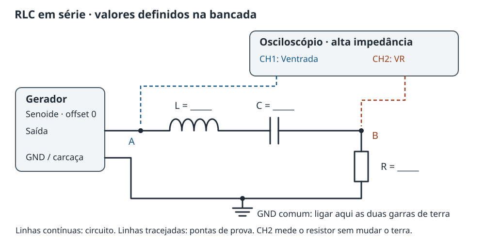

# Relatório — Experimento 8: ressonância no circuito RLC

> Preencha com os componentes e instrumentos utilizados no dia. As tabelas
> estão vazias intencionalmente: não contêm resultados nem valores sugeridos.
> Registre previsões antes da coleta e identifique o que foi medido ou inferido.

## Identificação

**Turma:** ____________________ **Data:** ____________________

**Grupo e integrantes:** __________________________________________________

**Gerador, modelo e faixa de frequências:** ________________________________

**Osciloscópio, modelo, banda e taxa de amostragem:** ________________________

**Pontas de prova e atenuação configurada nos canais:** _____________________

## Pergunta e previsão

Em que frequência a resposta do circuito em série é máxima? Como ela muda
quando alteramos apenas a resistência?

| Grandeza | Valor nominal | Valor medido ou estimado | Unidade / tolerância / método |
| --- | --- | --- | --- |
| Indutância L | ______ | ______ | ______ |
| Capacitância C | ______ | ______ | ______ |
| Resistor R, ensaio A | ______ | ______ | ______ |
| Resistor R, ensaio B | ______ | ______ | ______ |
| Resistência contínua da bobina rL | ______ | ______ | Ω / ______ |
| Resistência de saída do gerador Rs | ______ | ______ | Ω / manual: ______ |
| Perdas adicionais consideradas | ______ | ______ | ______ |

Não confunda µH com mH, nem nF com µF. Para o cálculo, converta L para henrys
e C para farads. Se não houver medidor de L ou C, use o valor nominal e
declare a tolerância; não invente uma medida.

\[
f_{0,\mathrm{prev}}=\frac{1}{2\pi\sqrt{LC}}=\underline{\hspace{2cm}}\;\mathrm{Hz}.
\]

**Previsão sobre o efeito de aumentar R:** _________________________________

## Montagem e ajustes

CH1 mede a tensão aplicada nos terminais do conjunto RLC; CH2 mede a tensão
no resistor. As duas garras de terra e o retorno do gerador ficam no mesmo
nó GND. A resistência Rs é interna ao gerador, não um resistor extra a montar.

**Forma de onda:** senoide. **Offset:** zero.

**Amplitude ajustada / medida em CH1:** __________ / __________ Vpp.

**Configuração de carga no gerador:** __________.

**Impedância de entrada dos canais:** __________.

**Faixa de varredura e passo grosso / fino:** ______________________________.

**Procedimento para manter ou acompanhar a entrada:** _____________________.

Use uma amplitude pequena, aprovada na bancada, que mantenha o circuito
linear e os componentes e instrumentos dentro de suas especificações.
Meça a entrada real; o número no painel do gerador depende da carga configurada.
Não ative a terminação de 50 Ω no osciloscópio nesta montagem.

## Referencial teórico

Parta da lei das malhas, com i = dq/dt. A fonte ideal interna é vs(t),
Rs é sua resistência de saída, e Re reúne as resistências externas:
R, perdas da bobina e, quando relevantes, perdas série do capacitor.
No modelo aproximado de resistências constantes, RΣ = Rs + Re.

\[
L\frac{d^2q}{dt^2}+R_\Sigma\frac{dq}{dt}+\frac{q}{C}
=V_{s,p}\cos(\omega t).
\]

Mostre que tentar q = A cos(ωt) + B sen(ωt) leva a:

\[
I_p=\frac{V_{s,p}}
{\sqrt{R_\Sigma^2+\left(\omega L-\frac{1}{\omega C}\right)^2}}.
\]

Explique por que o máximo da corrente, a amplitude interna constante,
ocorre quando ωL = 1/(ωC). Diferencie a frequência de ressonância forçada
da frequência da oscilação livre amortecida.

Para comparar os dados dos dois canais, use a função de transferência
referida à entrada externa, não à fonte ideal interna:

\[
H(f)=\frac{V_{R,pp}}{V_{\mathrm{in},pp}}
=\frac{R}{\sqrt{R_e^2+
\left(2\pi fL-\frac{1}{2\pi fC}\right)^2}}.
\]

Rs afeta a corrente real, mas não entra no denominador desta razão, pois
CH1 já mede a tensão depois dela. Não misture os dois modelos ao calcular Q.

## Dados brutos

Faça uma varredura ampla e refine perto do máximo e dos dois pontos de
meia potência. Registre pelo menos 15 frequências bem distribuídas, incluindo
pontos abaixo e acima da ressonância. Duplique a tabela para outro resistor.

**Ensaio:** ______ **R:** ______ Ω **L:** ______ H **C:** ______ F.

| f (Hz) | Vin,pp (V), CH1 | VR,pp (V), CH2 | Δt (s), com sinal | T (s) |
| --- | --- | --- | --- | --- |
| ______ | ______ | ______ | ______ | ______ |
| ______ | ______ | ______ | ______ | ______ |
| ______ | ______ | ______ | ______ | ______ |
| ______ | ______ | ______ | ______ | ______ |
| ______ | ______ | ______ | ______ | ______ |
| ______ | ______ | ______ | ______ | ______ |
| ______ | ______ | ______ | ______ | ______ |
| ______ | ______ | ______ | ______ | ______ |
| ______ | ______ | ______ | ______ | ______ |
| ______ | ______ | ______ | ______ | ______ |
| ______ | ______ | ______ | ______ | ______ |
| ______ | ______ | ______ | ______ | ______ |
| ______ | ______ | ______ | ______ | ______ |
| ______ | ______ | ______ | ______ | ______ |
| ______ | ______ | ______ | ______ | ______ |

Defina Δt = tR − tin entre cruzamentos ascendentes correspondentes, no mesmo
ciclo. Δt positivo significa que CH2 está atrasado. Guarde capturas abaixo,
perto e acima da ressonância, com escalas e atenuação identificadas.
Se houver apenas um canal, registre amplitudes em leituras sucessivas sob
condições estáveis e identifique a fase como não medida.

## Tratamento e resultados

Para senoides sem offset, use:

\[
I_{pp}=\frac{V_{R,pp}}{R},\qquad
I_{\mathrm{rms}}=\frac{V_{R,pp}}{2\sqrt{2}R},\qquad
\phi=-360^\circ\frac{\Delta t}{T}.
\]

Construa VR,pp versus f, H versus f e fase versus f. Diferencie o máximo da
amplitude ao variar f dos máximos instantâneos de cada senoide.
Não use a média temporal da senoide para procurar a ressonância.

Localize f₀,exp pelo máximo de H e compare com o cruzamento de fase por zero.
Refine a varredura: o maior ponto de uma malha grosseira não determina o
máximo exato.

Para H, localize f₁ e f₂ onde H = Hmax/√2, isto é, −3 dB em relação ao máximo:

\[
\Delta f=f_2-f_1,\qquad
Q_H=\frac{f_{0,\mathrm{exp}}}{\Delta f},\qquad
Q_{H,\mathrm{prev}}=\frac{1}{R_e}\sqrt{\frac{L}{C}}.
\]

Essas expressões usam H = VR/Vin. Para uma curva de corrente com fonte
interna constante, o fator de qualidade carregado pelo gerador é
QΣ = √(L/C)/(Rs + Re). Não compare a largura de uma curva com o Q da outra.
Se os dois cruzamentos não estiverem na faixa medida, declare Q como
não determinado; não extrapole silenciosamente.

| Resultado | Ensaio A | Ensaio B | Unidade / incerteza |
| --- | --- | --- | --- |
| R | ______ | ______ | Ω / ______ |
| f₀ previsto | ______ | ______ | Hz / ______ |
| f₀ experimental | ______ | ______ | Hz / ______ |
| Hmax | ______ | ______ | adimensional / ______ |
| f₁ | ______ | ______ | Hz / ______ |
| f₂ | ______ | ______ | Hz / ______ |
| Δf | ______ | ______ | Hz / ______ |
| QH medido / previsto | ______ | ______ | ______ |
| Fase em f₀ | ______ | ______ | graus / ______ |

## Incertezas e discussão

Com L e C independentes, a propagação de incertezas-padrão fornece:

\[
\frac{u(f_0)}{f_0}=\frac12
\sqrt{\left(\frac{u_L}{L}\right)^2+\left(\frac{u_C}{C}\right)^2}.
\]

Tolerância nominal não é automaticamente incerteza-padrão. Explique o
critério adotado e considere resolução de frequência, passo da varredura,
ruído na leitura de Vpp, instrumentos, perdas e carregamento das pontas.

1. O máximo de H e a fase nula concordaram dentro da resolução da medida?
2. A corrente adiantou abaixo de f₀ e atrasou acima? Mostre o sinal de Δt.
3. Aumentar R alargou a resposta? O que aconteceu com a corrente e com
   VR? Explique por que aumentar R não obriga VR a diminuir.
4. A tensão em CH1 variou na varredura? Como isso afetou VR e H?
5. A resistência DC da bobina descreve todas as perdas na frequência usada?
6. O valor medido de Q corresponde a H ou à corrente com fonte interna
   constante? Que resistências entram na previsão escolhida?
7. Quais diferenças podem vir de parasitas, tolerâncias ou da malha de
   frequências? Sustente a discussão com observações, não apenas “erro humano”.

## Conclusão

Responda à pergunta inicial com f₀, largura e Q quando determinados, suas
incertezas e o efeito de R. Identifique limitações reais e não declare
medidas que o equipamento disponível não permitiu.

## Referências

- OpenStax. University Physics, volume 2, seções 15.3 e 15.5:
  https://openstax.org/books/university-physics-volume-2/pages/15-3-rlc-series-circuits-with-ac
  e https://openstax.org/books/university-physics-volume-2/pages/15-5-resonance-in-an-ac-circuit.
- Bumm, L. A. RLC Resonant Circuits, University of Oklahoma:
  https://www.nhn.ou.edu/~bumm/ELAB/Labs/lab07_RLC_Resonant_Circuits_v2_3_0.html.
- Manuais e folhas de dados efetivamente utilizados: ____________________.

## Checklist de entrega

- [ ] Componentes, instrumentos, ajustes e unidades registrados.
- [ ] Esquema/fotografia com CH1, CH2 e GND identificados.
- [ ] Dedução da EDO, da amplitude e da condição de ressonância.
- [ ] Dados brutos, previsões e resultados separados.
- [ ] Curvas de amplitude e fase, quando medida, com eixos e unidades.
- [ ] Frequência de ressonância e largura estimadas com resolução adequada.
- [ ] Comparação entre resistores, se realizada.
- [ ] Modelo de perdas, incertezas, conclusão e referências.
